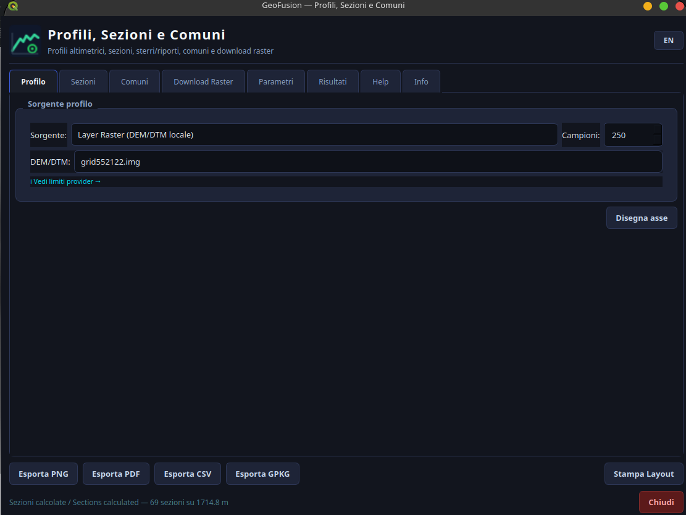
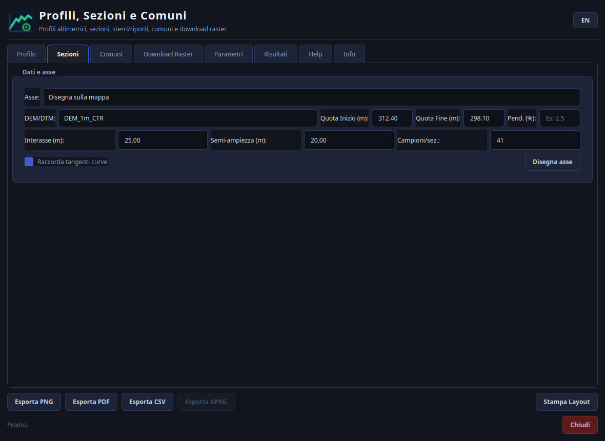
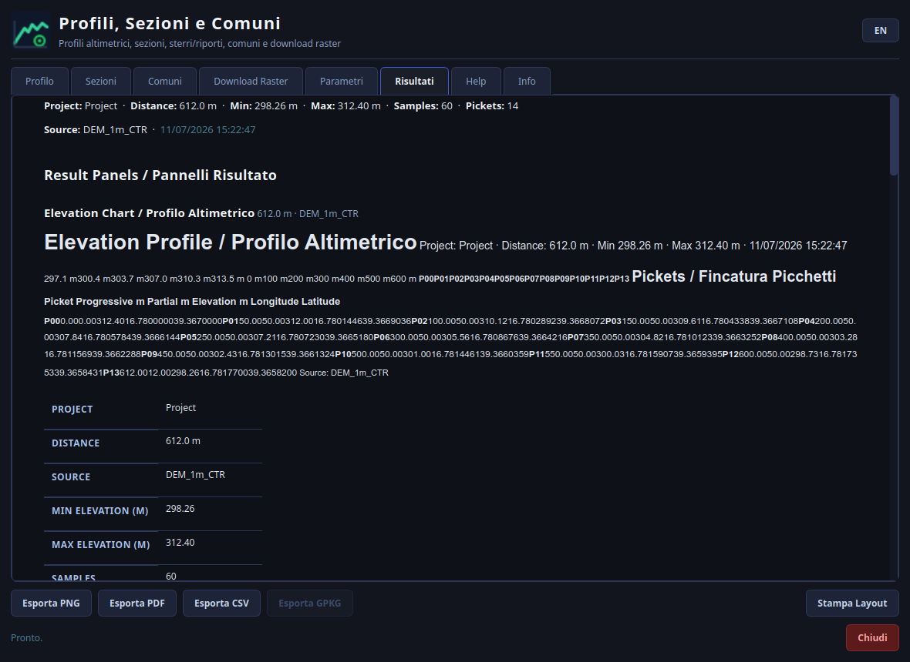
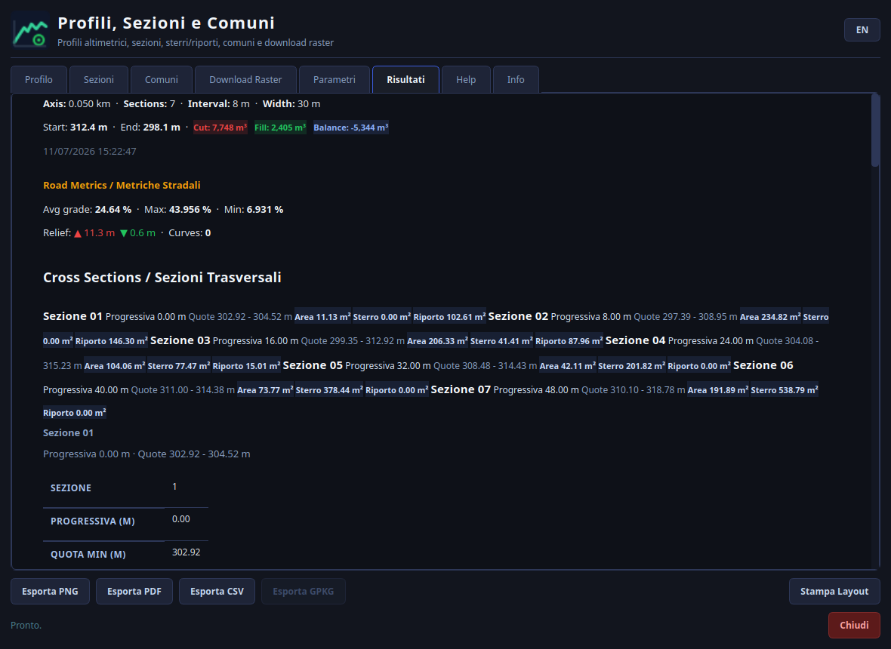
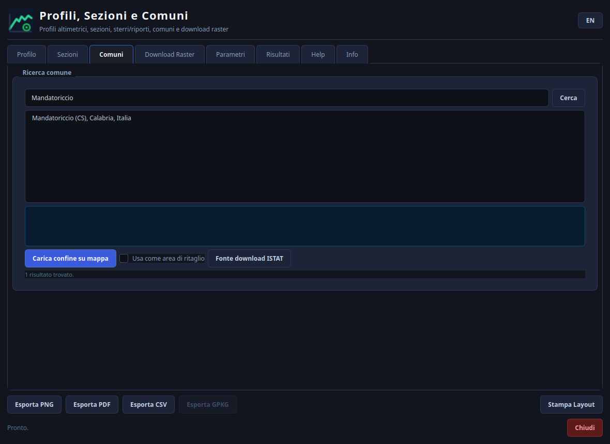

# Profili, Sezioni e Comuni

[](https://qgis.org/)
[](LICENSE)
[](metadata.txt)

Plugin QGIS per profili altimetrici, sezioni trasversali con volumi di sterro/riporto, download raster DTM italiani, ricerca confini comunali e confronto prima/dopo lavori (GeoPackage e differenza DTM).
QGIS plugin for elevation profiles, cross sections with cut/fill volumes, Italian DTM raster download, Italian municipality boundary search and before/after works comparison (GeoPackage and DTM difference).

**🇮🇹 [Italiano](#italiano) &nbsp;·&nbsp; 🇬🇧 [English](#english)**

## Screenshot / Screenshots

| Tab Profilo / Profile tab | Parametri sezioni / Section parameters |
| --- | --- |
|  |  |

| Risultati profilo / Profile results | Risultati sezioni e volumi / Section & volume results |
| --- | --- |
|  |  |

| Ricerca comuni / Municipality search |
| --- |
|  |

---

# Italiano

Plugin QGIS bilingue (italiano/inglese) per:

- generare profili altimetrici;
- calcolare sezioni trasversali;
- stimare sterri, riporti e volumi;
- scaricare o ritagliare raster da area disegnata (dataset italiani);
- cercare e caricare rapidamente i confini comunali italiani;
- confrontare lo stato prima/dopo i lavori (GeoPackage generati dal plugin e differenza DTM);
- esportare risultati in `PNG`, `PDF`, `CSV`, `GPKG` e layout QGIS con legenda, reticolo, scala e cartiglio.

Il plugin ha interfaccia bilingue italiano/inglese (pulsante `IT`/`EN` in alto a destra) e funziona con `QGIS 3.16+` fino a `QGIS 4.x`.

## Indice

- [Panoramica](#panoramica)
- [Funzioni principali](#funzioni-principali)
- [Requisiti](#requisiti)
- [Installazione](#installazione)
- [Interfaccia](#interfaccia)
- [Flusso rapido](#flusso-rapido)
- [Uso del tab Profilo](#uso-del-tab-profilo)
- [Uso del tab Sezioni](#uso-del-tab-sezioni)
- [Uso del tab Comuni](#uso-del-tab-comuni)
- [Uso del tab Download Raster](#uso-del-tab-download-raster)
- [Uso del tab Confronto](#uso-del-tab-confronto)
- [Uso del tab Parametri](#uso-del-tab-parametri)
- [Output generati](#output-generati)
- [Consigli operativi](#consigli-operativi)
- [Troubleshooting](#troubleshooting)
- [Struttura del progetto](#struttura-del-progetto)
- [Autore e licenza](#autore-e-licenza)

## Panoramica

`Profili, Sezioni e Comuni` nasce come strumento operativo per rilievo, verifica altimetrica e studio preliminare di tracciati. Il plugin consente di lavorare in due modi:

1. disegnando direttamente un asse in mappa;
2. usando una geometria linea già presente nel progetto.

Il flusso tipico è:

1. scegliere una sorgente altimetrica;
2. tracciare o selezionare un asse;
3. calcolare profilo o sezioni;
4. verificare grafici e tabelle;
5. esportare in formati tecnici.

## Funzioni principali

### Profili altimetrici

- campionamento quote lungo un asse;
- supporto a `Open-Elevation`, `OpenTopoData` o raster locale `DEM/DTM`;
- generazione grafico profilo;
- creazione automatica di asse, campioni e picchetti come layer vettoriali;
- opzione `Crea profilo 3D`: layer vettoriali Z-enabled (quota reale come coordinata Z) per la Vista Mappa 3D di QGIS, più esportazione opzionale come nuvola di punti LAS.

### Sezioni trasversali e volumi

- sezioni a interasse regolare;
- impostazione di semi-ampiezza e numero campioni per sezione;
- confronto con quota/profilo di progetto;
- calcolo aree di sezione, sterro, riporto e volumi tra sezioni;
- layer dedicati per sezioni, centri, punti, curve, tratte volume, disegni tecnici e poligoni sterro/riporto;
- opzione `Crea profilo 3D`: layer Z-enabled per ogni sezione (quota reale come coordinata Z) più esportazione opzionale come nuvola di punti LAS.

### Download raster da area

- selezione area con `SHIFT + trascinamento`;
- supporto a `TINITALY 1.1` e `HR-DTM-5m` (dataset che coprono solo il territorio italiano);
- ritaglio dell'area e salvataggio in `GeoTIFF`;
- scrittura automatica di una ricevuta con fonte, licenza e citazione.

### Ricerca comuni

- ricerca rapida via `Nominatim`;
- caricamento del confine in mappa;
- possibilità di usare il comune come area di ritaglio;
- collegamento alla fonte ufficiale ISTAT per i confini amministrativi.

### Confronto prima/dopo lavori

- confronto tra due GeoPackage generati dal plugin sulla stessa area (rilievo prima dei lavori vs dopo);
- variazioni di quota lungo il profilo con grafico delta (Δ media, min, max, RMS);
- confronto sezione per sezione (accoppiamento per progressiva con tolleranza regolabile);
- bilancio sterri/riporti prima vs dopo;
- confronto DTM: raster differenza (dopo - prima) con statistiche, volumi di scavo/riporto sopra soglia e stile divergente automatico (rosso = abbassamento, blu = innalzamento);
- calcolo deterministico GDAL/NumPy, senza AI.

### Export

- `PNG` del grafico;
- `PDF` del layout cartografico multi-foglio;
- `CSV` dei risultati;
- `GPKG` con i layer vettoriali generati;
- apertura di un layout QGIS per la stampa con legenda per tipologia (ogni voce una sola volta), reticolo con coordinate, barra di scala, cartiglio con titolo/autore/data/CRS/scala e grafici in miniatura, più un foglio dedicato per ogni grafico con la relativa tabella attributi.

## Requisiti

### Software

- `QGIS 3.16` o superiore
- compatibilità dichiarata fino a `QGIS 4.99`

### Dati consigliati

- per analisi preliminari: API altimetriche globali;
- per lavoro tecnico: raster locale `DEM/DTM` in CRS metrico;
- per sezioni e volumi: preferibile usare un `DTM` di progetto o raster ad alta qualità.

### Note importanti

- le API pubbliche possono avere limiti di richiesta;
- i risultati dipendono dalla qualità del raster;
- le quote da dataset globali non sostituiscono rilievi topografici o LiDAR di progetto.

## Installazione

### Installazione da ZIP

1. scarica il plugin in formato `.zip`;
2. apri QGIS;
3. vai in `Plugin > Gestisci e installa plugin...`;
4. scegli `Installa da ZIP`;
5. seleziona l'archivio del plugin;
6. conferma l'installazione.

### Installazione manuale per sviluppo

1. copia la cartella `profili_sezioni_comuni` nella directory plugin di QGIS;
2. riavvia QGIS;
3. abilita il plugin dal gestore plugin.

## Interfaccia

Il plugin espone i seguenti tab:

| Tab | Scopo |
| --- | --- |
| `Profilo` | Calcolo del profilo altimetrico |
| `Sezioni` | Calcolo sezioni, aree e volumi |
| `Comuni` | Ricerca e caricamento confini comunali |
| `Download Raster` | Ritaglio/scarico raster da area |
| `Confronto` | Confronto prima/dopo lavori (GeoPackage e DTM) |
| `Parametri` | Etichette report e punto di inserimento |
| `Risultati` | Anteprima grafici e tabelle |
| `Help` | Aiuto sintetico integrato |
| `Info` | Fonti, accuratezza, limiti e licenze |

In basso sono disponibili i pulsanti export:

- `Esporta PNG`
- `Esporta PDF`
- `Esporta CSV`
- `Esporta GPKG`
- `Stampa Layout`

Questi pulsanti si attivano dopo un calcolo valido.

## Flusso rapido

### Caso 1: profilo altimetrico

1. apri il tab `Profilo`;
2. scegli la sorgente quote;
3. imposta il numero di campioni;
4. clicca `Disegna asse`;
5. disegna la polilinea in mappa;
6. termina con doppio clic;
7. consulta il tab `Risultati`;
8. esporta se necessario.

### Caso 2: sezioni e volumi

1. apri il tab `Sezioni`;
2. seleziona il raster;
3. scegli se disegnare l'asse o usare un layer linea;
4. imposta interasse, semi-ampiezza e campioni;
5. facoltativamente inserisci quota iniziale, quota finale o pendenza di progetto;
6. avvia il calcolo;
7. verifica sezioni, tabelle e volumi;
8. esporta i risultati.

### Caso 3: download raster

1. apri `Download Raster`;
2. clicca `SHIFT + disegna area`;
3. tieni premuto `SHIFT` e trascina un rettangolo;
4. scegli la sorgente raster;
5. seleziona il file di output;
6. avvia il download.

## Uso del tab Profilo

### Sorgenti disponibili

Nel tab `Profilo` puoi scegliere:

- `Open-Elevation API (SRTM/NASA)`
- `OpenTopoData API (SRTM 90m)`
- `Layer Raster (DEM/DTM locale)`

Se scegli il raster locale, compare il selettore del layer `DEM/DTM`.

### Parametri disponibili

- `Campioni`: numero di campioni lungo il tracciato;
- `DEM/DTM`: raster usato per leggere le quote, se lavori in locale.

### Procedura

1. seleziona la sorgente;
2. se usi un raster, scegli il layer corretto;
3. imposta i campioni;
4. clicca `Disegna asse`;
5. inserisci i vertici in mappa;
6. termina con doppio clic.

### Cosa genera

Dopo il calcolo il plugin produce:

- grafico del profilo;
- tabella risultati;
- layer asse del profilo;
- layer campioni;
- layer picchetti;
- esportazione automatica in `GPKG` nella cartella output del progetto;
- se `Crea profilo 3D` è attivo: layer `LineStringZ` (asse quotato) e `PointZ` (punti quotati) con la quota reale come coordinata Z, visualizzabili nella Vista Mappa 3D di QGIS, più un file `.las` (nuvola di punti) nella sottocartella `_pointcloud`.

### Comportamento utile

Se il profilo è stato calcolato usando un raster locale, il plugin può chiedere se vuoi lanciare subito anche il calcolo delle sezioni sullo stesso asse.

## Uso del tab Sezioni

### Modalità asse

Sono disponibili due modalità:

- `Disegna sulla mappa`
- `Layer linea / Line layer`

Se scegli `Layer linea`, puoi indicare:

- il layer linea;
- la feature da usare:
  - `Prima feature / First feature`
  - `Linea più lunga / Longest line`

### Parametri di input

| Campo | Significato |
| --- | --- |
| `DEM/DTM` | raster usato per il campionamento |
| `Quota Inizio (m)` | quota di progetto iniziale |
| `Quota Fine (m)` | quota di progetto finale |
| `Pend. (%)` | pendenza di progetto |
| `Interasse (m)` | distanza tra sezioni |
| `Semi-ampiezza (m)` | metà larghezza della sezione |
| `Campioni/sez.` | numero di punti campionati per sezione |
| `Raccorda tangenti curve` | smussa l'azimut vicino ai cambi di direzione |

Puoi compilare:

- quota iniziale e quota finale;
- quota iniziale e pendenza;
- solo quota iniziale;
- nessun valore, se vuoi una lettura puramente descrittiva del terreno.

### Procedura con asse disegnato

1. scegli `Disegna sulla mappa`;
2. imposta i parametri;
3. clicca `Disegna asse`;
4. traccia la linea;
5. attendi il calcolo.

### Procedura con layer linea

1. scegli `Layer linea / Line layer`;
2. seleziona il layer;
3. scegli `Prima feature` o `Linea più lunga`;
4. clicca `Calcola da layer`.

### Cosa genera

Il plugin costruisce i seguenti layer vettoriali:

- asse;
- sezioni planimetriche;
- punti sezione;
- centri sezione;
- curve;
- tratte volumi;
- disegni tecnici di sezione;
- poligoni di sterro/riporto;
- se `Crea profilo 3D` è attivo: un layer `LineStringZ` (una linea per sezione, quota reale come Z) e un layer `PointZ` con tutti i punti campionati delle sezioni.

Genera inoltre:

- grafico delle sezioni;
- tabella volumi;
- tabella di dettaglio sezione;
- `GPKG` automatico;
- layout di stampa esportabile;
- se `Crea profilo 3D` è attivo: un file `.las` (nuvola di punti) con tutti i campioni delle sezioni, nella sottocartella `_pointcloud`.

## Uso del tab Comuni

### Funzioni disponibili

- ricerca di un comune italiano;
- anteprima del risultato selezionato;
- caricamento del confine in mappa;
- apertura della fonte ISTAT;
- opzione `Usa come area di ritaglio`.

### Procedura

1. digita il nome del comune;
2. clicca `Cerca`;
3. seleziona il risultato corretto;
4. clicca `Carica confine su mappa`.

### Quando usarlo

È utile per:

- inquadrare velocemente un territorio;
- costruire una base di lavoro preliminare;
- definire un'area da usare per il download raster.

### Avvertenza

Il confine caricato con Nominatim/OpenStreetMap è utile per ricerca rapida. Per usi amministrativi ufficiali, usare sempre il download ISTAT.

## Uso del tab Download Raster

### Sorgenti supportate

| Sorgente | Uso |
| --- | --- |
| `TINITALY 1.1` | download area da ZIP ufficiali e WCS opzionale |
| `HR-DTM-5m` | ritaglio remoto da dataset pubblicato su Zenodo |

Entrambe le sorgenti coprono **solo il territorio italiano**.

### Procedura

1. clicca `SHIFT + disegna area`;
2. tieni premuto `SHIFT`;
3. trascina il rettangolo in mappa;
4. rilascia il mouse;
5. scegli la sorgente;
6. indica il percorso di output `GeoTIFF`;
7. opzionalmente lascia attivo `Carica raster in QGIS dopo il download`;
8. clicca `Scarica area raster`.

### Comportamento del plugin

- crea un layer temporaneo dell'area;
- mostra avanzamento e stato del download;
- salva il raster ritagliato;
- può aggiungere il raster automaticamente nel progetto;
- scrive una ricevuta testuale con:
  - fonte;
  - licenza;
  - citazione.

### Pulsanti aggiuntivi

- `Apri fonte`: apre la pagina web della sorgente dati;
- `Carica WCS TINITALY`: aggiunge in QGIS il WCS TINITALY, se disponibile.

## Uso del tab Confronto

Il tab `Confronto` serve a confrontare la stessa area **prima e dopo i lavori**, senza AI: tutto il calcolo è matematica deterministica GDAL/NumPy.

### Confronto GeoPackage

1. genera (in momenti diversi) i GeoPackage con il plugin: rilievo prima dei lavori e rilievo dopo i lavori;
2. apri il tab `Confronto`: i `GPKG` della cartella di output sono elencati automaticamente (`Aggiorna elenco` per ricaricarli, `...` per file esterni);
3. scegli il `GPKG prima` e il `GPKG dopo`;
4. imposta la `Tolleranza (m)` per l'accoppiamento delle sezioni per progressiva;
5. clicca `Confronta GeoPackage`.

Il report nel tab `Risultati` mostra:

- variazioni di quota lungo il profilo con grafico delta (Δ media, min, max, RMS);
- confronto sezione per sezione (Δ quota min, Δ area, Δ sterro, Δ riporto);
- bilancio sterri/riporti prima vs dopo.

### Confronto DTM

1. seleziona `DTM prima` e `DTM dopo` (layer del progetto o file `GeoTIFF`);
2. imposta la `Soglia Δ (m)` sotto la quale le variazioni sono considerate rumore;
3. clicca `Confronta DTM`.

Il plugin allinea automaticamente le griglie (anche con CRS o risoluzioni diverse), scrive il raster differenza `dopo - prima` in `GeoTIFF` e lo carica con scala di colori divergente: **rosso = abbassamento (scavo), blu = innalzamento (riporto)**. Il report include Δ quota media/min/max, RMS, volumi e aree di scavo/riporto sopra soglia e bilancio netto.

**Nota:** per volumi accurati usa DTM in CRS metrico (es. UTM); con CRS geografici i valori sono approssimati e segnalati come tali.

## Uso del tab Parametri

Questo tab consente di personalizzare le etichette usate nei report e nei grafici.

### Campi modificabili

- `Picchetto / Peg`
- `Distanze progressive / Progressive distances`
- `Quota terreno / Ground Level`
- `Quote tubo / Pipe Levels`
- `Fondo scavo / Bottom Excavation Level`
- `Sterro / Cut`
- `Riporto / Fill`
- `Accumuli / Stockpiles`

### Punto di inserimento

Puoi impostare:

- coordinata `X`;
- coordinata `Y`;
- oppure usare il pulsante `...` per prendere il centro della vista corrente.

Questo punto è usato come riferimento per i disegni tecnici di sezione creati in mappa.

### Pulsanti disponibili

- `Settaggi automatici`
- `Ripristina default`
- `Salva parametri`

## Output generati

### Cartella output

Se il progetto QGIS ha una `homePath`, il plugin scrive in:

```text
<homePath_progetto>/profili_sezioni_output/
```

Altrimenti usa una cartella nella home utente.

### File esportabili

| Formato | Contenuto |
| --- | --- |
| `PNG` | grafico del profilo o delle sezioni |
| `PDF` | layout stampabile |
| `CSV` | campioni profilo oppure sezioni/volumi |
| `GPKG` | layer vettoriali prodotti dal calcolo |
| `GeoTIFF` | raster area ritagliata oppure raster differenza DTM (`dtm_diff_*.tif`) |

### Layer prodotti nel profilo

- asse profilo;
- campioni;
- picchetti.

### Layer prodotti nelle sezioni

- asse;
- curve;
- sezioni planimetriche;
- punti sezione;
- centri sezione;
- volumi per tratta;
- disegni tecnici;
- poligoni sterro/riporto.

### Layout di stampa

`Esporta PDF` e `Stampa Layout` producono un layout cartografico A3 con:

- mappa con **reticolo** di coordinate e cornice zebra;
- **barra di scala**;
- **legenda per tipologia**: ogni tipo di layer compare una sola volta;
- **cartiglio** con titolo, autore, data, CRS, scala e grafici in miniatura;
- **un foglio per ogni grafico** (profilo e/o sezioni) con la relativa tabella attributi.

### Raggruppamento in QGIS

I layer vengono aggiunti in gruppi dedicati nel pannello layer, separati per:

- profilo;
- sezioni e volumi;
- raster scaricati;
- confronto DTM.

## Consigli operativi

### CRS

- usa preferibilmente un CRS proiettato metrico;
- controlla che il raster abbia CRS corretto;
- per profili lunghi o rilievi tecnici evita di lavorare in coordinate geografiche se non strettamente necessario.

### Importanza del CRS nelle misure da file

Quando il plugin lavora con `Layer Raster (DEM/DTM locale)`, le quote del profilo e delle sezioni vengono lette realmente dal dato raster selezionato. Questo significa che:

- la qualità delle misure dipende anche dal `CRS` del progetto e del raster;
- un `CRS geografico` non è la scelta corretta per elaborati metrici, disegni tecnici e confronti volumetrici DTM;
- per distanze, aree, sezioni e volumi è fortemente consigliato usare un `CRS proiettato metrico` coerente con il territorio di lavoro;
- se il `CRS` del progetto e quello del `DEM` sono diversi, il plugin riproietta i punti per leggere le quote, ma resta comunque buona pratica lavorare in un contesto CRS coerente.

### Qualità del raster

- verifica risoluzione e presenza di `NoData`;
- per calcoli di volume usa raster coerenti con la scala del progetto;
- maggiore è la qualità del raster, maggiore è l'affidabilità della sezione.

### Scelta dei parametri

- `Interasse` basso = più sezioni, maggiore dettaglio;
- `Campioni/sez.` alto = curva sezione più dettagliata;
- `Semi-ampiezza` deve coprire l'intera fascia trasversale utile.

### Verifica risultati

Prima di usare i volumi in modo operativo, controlla sempre:

- andamento del profilo;
- correttezza delle quote min/max;
- congruenza tra asse e raster;
- valori di sterro/riporto anomali.

## Troubleshooting

### Non vedo i raster nel menu

Verifica di avere caricato almeno un layer raster nel progetto. I selettori `DEM/DTM` si popolano leggendo i layer correnti di QGIS.

### Il pulsante export è disabilitato

Gli export si attivano solo dopo un calcolo completato con successo.

### Il profilo non usa il raster corretto

Controlla che:

- il raster selezionato sia quello giusto;
- il CRS del progetto sia coerente;
- il raster contenga valori validi nell'area attraversata.

### Le quote sembrano poco affidabili

Se stai usando API globali, il dato può essere troppo grossolano per uso topografico. Passa a un `DEM/DTM` locale.

### Il confronto GeoPackage non trova dati confrontabili

Il confronto funziona con i `GPKG` generati da questo plugin (campioni profilo, picchetti, centri sezione, tratte volumi). Verifica di aver selezionato due pacchetti prodotti dal plugin e che la tolleranza copra lo scostamento tra le progressive.

### Il download raster fallisce

Verifica:

- connessione internet;
- percorso di output scrivibile;
- disponibilità temporanea della sorgente remota;
- eventuali limiti del provider.

### La nuvola di punti 3D non compare come layer in QGIS

Il file `.las` viene sempre scritto sul disco (cartella `_pointcloud`), ma per essere caricato automaticamente come layer in QGIS l'installazione deve includere il provider point cloud `PDAL`. Se il tuo QGIS non lo include, il plugin te lo segnala e il file resta comunque disponibile per essere aperto con CloudCompare, un'altra installazione QGIS con supporto PDAL o software LAS compatibili. Il layer vettoriale `LineStringZ`/`PointZ` (Vista Mappa 3D di QGIS) funziona invece sempre, senza requisiti aggiuntivi.

### Il tab Risultati mostra testo senza grafico/stile

Il plugin usa `QtWebEngine` per un rendering ricco (grafico, accordion). Se il tuo QGIS/Python non include `QtWebEngine`, il plugin usa automaticamente un fallback più semplice (`QTextBrowser`), meno curato ma pienamente funzionale per consultare dati e tabelle.

## Struttura del progetto

| File | Ruolo |
| --- | --- |
| `plugin.py` | entry point del plugin e logica principale |
| `dialog.py` | interfaccia utente |
| `map_tool.py` | strumenti di disegno in mappa |
| `core_elevation.py` | profili altimetrici, export e grafici |
| `core_sections.py` | sezioni, volumi e disegni tecnici |
| `core_comuni.py` | ricerca comuni e confini |
| `core_raster_download.py` | download e ritaglio raster |
| `core_confronto.py` | confronto prima/dopo lavori (GeoPackage e DTM) |
| `core_pointcloud.py` | scrittore nuvola di punti LAS 1.2 (solo libreria standard) |
| `qt_compat.py` | compatibilità PyQt5/PyQt6 |
| `metadata.txt` | metadati plugin QGIS |
| `icon.svg` | icona del plugin |
| `LICENSE` | testo licenza GPL-2.0 |

## Autore e licenza

**Autore:** Dott. Sarino Alfonso Grande
**Email:** `info@sinocloud.it`

Repository/autore:

- Altri plugin QGIS dell'autore: <https://plugins.qgis.org/plugins/author/Dott.%20Sarino%20Alfonso%20Grande/>
- GitHub: <https://github.com/sag1687>
- Sito: <https://sinocloud.it>

Licenza:

- `GPL-2.0`

### Nota finale

Questo plugin è pensato per ridurre i tempi operativi in ambiente QGIS, ma i risultati devono essere sempre verificati con criterio tecnico, soprattutto quando si usano dati remoti o modelli altimetrici a bassa risoluzione.

---

# English

QGIS bilingual plugin (Italian/English) to:

- generate elevation profiles;
- calculate cross sections;
- estimate cut, fill and earthwork volumes;
- download or clip rasters from a drawn area (Italian datasets);
- quickly search and load Italian municipality boundaries;
- compare the before/after works state (plugin-generated GeoPackages and DTM difference);
- export results as `PNG`, `PDF`, `CSV`, `GPKG` and a QGIS print layout with legend, grid, scale bar and title block.

The plugin has a bilingual Italian/English interface (`IT`/`EN` button, top right) and works with `QGIS 3.16+` up to `QGIS 4.x`.

## Table of contents

- [Overview](#overview)
- [Main features](#main-features)
- [Requirements](#requirements)
- [Installation](#installation)
- [Interface](#interface)
- [Quick workflow](#quick-workflow)
- [Using the Profile tab](#using-the-profile-tab)
- [Using the Sections tab](#using-the-sections-tab)
- [Using the Municipalities tab](#using-the-municipalities-tab)
- [Using the Raster Download tab](#using-the-raster-download-tab)
- [Using the Comparison tab](#using-the-comparison-tab)
- [Using the Parameters tab](#using-the-parameters-tab)
- [Generated output](#generated-output)
- [Operational tips](#operational-tips)
- [Troubleshooting-en](#troubleshooting-en)
- [Project structure](#project-structure)
- [Author and license](#author-and-license)

## Overview

`Profili, Sezioni e Comuni` (Profiles, Sections & Municipalities) is an operational tool for survey work, elevation verification and preliminary alignment studies. The plugin supports two workflows:

1. drawing an axis directly on the map;
2. using an existing line geometry already in the project.

Typical workflow:

1. choose an elevation source;
2. draw or select an axis;
3. calculate profile or cross sections;
4. review charts and tables;
5. export to technical formats.

## Main features

### Elevation profiles

- elevation sampling along an axis;
- support for `Open-Elevation`, `OpenTopoData` or a local `DEM/DTM` raster;
- profile chart generation;
- automatic creation of axis, sample points and pegs as vector layers;
- `Create 3D profile` option: Z-enabled vector layers (real elevation as the Z coordinate) for QGIS's 3D Map View, plus an optional LAS point cloud export.

### Cross sections and volumes

- regular-interval sections;
- configurable half-width and samples per section;
- comparison against a design elevation/profile;
- section area, cut, fill and inter-section volume calculation;
- dedicated layers for sections, centers, points, curves, volume segments, technical drawings and cut/fill polygons;
- `Create 3D profile` option: Z-enabled layer per section (real elevation as the Z coordinate) plus an optional LAS point cloud export.

### Area raster download

- area selection with `SHIFT + drag`;
- support for `TINITALY 1.1` and `HR-DTM-5m` (datasets covering Italy only);
- area clipping and `GeoTIFF` output;
- automatic receipt with source, license and citation.

### Municipality search

- fast search via `Nominatim`;
- boundary loading on the map;
- option to use the municipality as a clip area;
- link to the official ISTAT source for administrative boundaries.

### Before/after works comparison

- comparison between two plugin-generated GeoPackages over the same area (survey before vs after the works);
- elevation changes along the profile with a delta chart (mean, min, max, RMS Δ);
- section-by-section comparison (chainage pairing with adjustable tolerance);
- cut/fill balance before vs after;
- DTM comparison: difference raster (after - before) with statistics, above-threshold cut/fill volumes and automatic diverging style (red = lowering, blue = raising);
- deterministic GDAL/NumPy computation, no AI.

### Export

- `PNG` of the chart;
- `PDF` of the multi-sheet cartographic layout;
- `CSV` of the results;
- `GPKG` with the generated vector layers;
- opens a QGIS print layout with a per-typology legend (each entry once), coordinate grid, scale bar, title block with title/author/date/CRS/scale and chart thumbnails, plus one dedicated sheet per chart with its attribute table.

## Requirements

### Software

- `QGIS 3.16` or later
- declared compatibility up to `QGIS 4.99`

### Recommended data

- for preliminary analysis: global elevation APIs;
- for technical work: a local `DEM/DTM` raster in a metric CRS;
- for sections and volumes: a project `DTM` or a high-quality raster is preferable.

### Important notes

- public APIs may have request limits;
- results depend on raster quality;
- elevations from global datasets do not replace topographic or LiDAR surveys.

## Installation

### Install from ZIP

1. download the plugin as a `.zip`;
2. open QGIS;
3. go to `Plugins > Manage and Install Plugins...`;
4. choose `Install from ZIP`;
5. select the plugin archive;
6. confirm the installation.

### Manual install for development

1. copy the `profili_sezioni_comuni` folder into the QGIS plugins directory;
2. restart QGIS;
3. enable the plugin from the plugin manager.

## Interface

The plugin exposes the following tabs:

| Tab | Purpose |
| --- | --- |
| `Profile` | Elevation profile calculation |
| `Sections` | Section, area and volume calculation |
| `Municipalities` | Municipality boundary search and loading |
| `Raster Download` | Raster clipping/download from an area |
| `Comparison` | Before/after works comparison (GeoPackage and DTM) |
| `Parameters` | Report labels and insertion point |
| `Results` | Chart and table preview |
| `Help` | Built-in quick help |
| `Info` | Sources, accuracy, limits and licenses |

Export buttons at the bottom:

- `Export PNG`
- `Export PDF`
- `Export CSV`
- `Export GPKG`
- `Print Layout`

These buttons are enabled after a valid calculation.

## Quick workflow

### Case 1: elevation profile

1. open the `Profile` tab;
2. choose the elevation source;
3. set the number of samples;
4. click `Draw axis`;
5. draw the polyline on the map;
6. finish with a double click;
7. check the `Results` tab;
8. export if needed.

### Case 2: sections and volumes

1. open the `Sections` tab;
2. select the raster;
3. choose whether to draw the axis or use a line layer;
4. set interval, half-width and samples;
5. optionally enter a start elevation, end elevation or design grade;
6. run the calculation;
7. review sections, tables and volumes;
8. export the results.

### Case 3: raster download

1. open `Raster Download`;
2. click `SHIFT + draw area`;
3. hold `SHIFT` and drag a rectangle;
4. choose the raster source;
5. select the output file;
6. start the download.

## Using the Profile tab

### Available sources

In the `Profile` tab you can choose:

- `Open-Elevation API (SRTM/NASA)`
- `OpenTopoData API (SRTM 90m)`
- `Raster Layer (local DEM/DTM)`

If you choose the local raster, the `DEM/DTM` layer selector appears.

### Available parameters

- `Samples`: number of samples along the alignment;
- `DEM/DTM`: raster used to read elevations, if working locally.

### Procedure

1. select the source;
2. if using a raster, choose the correct layer;
3. set the sample count;
4. click `Draw axis`;
5. add vertices on the map;
6. finish with a double click.

### What it produces

After the calculation the plugin generates:

- profile chart;
- results table;
- profile axis layer;
- samples layer;
- pegs layer;
- automatic `GPKG` export in the project output folder;
- if `Create 3D profile` is enabled: a `LineStringZ` layer (elevation axis) and a `PointZ` layer (elevation samples) with real elevation as the Z coordinate, viewable in QGIS's 3D Map View, plus a `.las` point cloud file in the `_pointcloud` subfolder.

### Useful behavior

If the profile was calculated using a local raster, the plugin may ask whether you also want to immediately run the cross-section calculation on the same axis.

## Using the Sections tab

### Axis mode

Two modes are available:

- `Draw on map`
- `Line layer`

If you choose `Line layer`, you can set:

- the line layer;
- the feature to use:
  - `First feature`
  - `Longest line`

### Input parameters

| Field | Meaning |
| --- | --- |
| `DEM/DTM` | raster used for sampling |
| `Start Elev (m)` | design start elevation |
| `End Elev (m)` | design end elevation |
| `Grade (%)` | design grade |
| `Interval (m)` | distance between sections |
| `Half-width (m)` | half the section width |
| `Samples/sec.` | number of sampled points per section |
| `Smooth curve tangents` | smooths the azimuth near direction changes |

You can fill in:

- start and end elevation;
- start elevation and grade;
- start elevation only;
- no value, for a purely descriptive reading of the terrain.

### Procedure with a drawn axis

1. choose `Draw on map`;
2. set the parameters;
3. click `Draw axis`;
4. draw the line;
5. wait for the calculation.

### Procedure with a line layer

1. choose `Line layer`;
2. select the layer;
3. choose `First feature` or `Longest line`;
4. click `Calculate from layer`.

### What it produces

The plugin builds the following vector layers:

- axis;
- planimetric sections;
- section points;
- section centers;
- curves;
- volume segments;
- section technical drawings;
- cut/fill polygons;
- if `Create 3D profile` is enabled: a `LineStringZ` layer (one line per section, real elevation as Z) and a `PointZ` layer with all sampled section points.

It also generates:

- section chart;
- volumes table;
- section detail table;
- automatic `GPKG`;
- exportable print layout;
- if `Create 3D profile` is enabled: a `.las` point cloud file with all section samples, in the `_pointcloud` subfolder.

## Using the Municipalities tab

### Available functions

- search for an Italian municipality;
- preview the selected result;
- load the boundary on the map;
- open the official ISTAT source;
- `Use as clip area` option.

### Procedure

1. type the municipality name;
2. click `Search`;
3. select the correct result;
4. click `Load boundary on map`.

### When to use it

Useful for:

- quickly framing a territory;
- building a preliminary work base;
- defining an area to use for raster download.

### Warning

The boundary loaded via Nominatim/OpenStreetMap is convenient for quick lookups. For official administrative use, always use the ISTAT download.

## Using the Raster Download tab

### Supported sources

| Source | Use |
| --- | --- |
| `TINITALY 1.1` | area download from official ZIP tiles, optional WCS |
| `HR-DTM-5m` | remote clipping from the dataset published on Zenodo |

Both sources cover **Italian territory only**.

### Procedure

1. click `SHIFT + draw area`;
2. hold `SHIFT`;
3. drag the rectangle on the map;
4. release the mouse;
5. choose the source;
6. set the `GeoTIFF` output path;
7. optionally leave `Load raster in QGIS after download` checked;
8. click `Download raster area`.

### Plugin behavior

- creates a temporary layer of the area;
- shows download progress and status;
- saves the clipped raster;
- can automatically add the raster to the project;
- writes a text receipt with:
  - source;
  - license;
  - citation.

### Additional buttons

- `Open source`: opens the data source web page;
- `Load TINITALY WCS`: adds the TINITALY WCS to QGIS, if available.

## Using the Comparison tab

The `Comparison` tab compares the same area **before and after the works**, without AI: everything is deterministic GDAL/NumPy math.

### GeoPackage comparison

1. generate (at different times) the GeoPackages with the plugin: survey before the works and survey after the works;
2. open the `Comparison` tab: the `GPKG` files in the output folder are listed automatically (`Refresh list` to reload them, `...` for external files);
3. choose the `GPKG before` and the `GPKG after`;
4. set the `Tolerance (m)` used to pair sections by chainage;
5. click `Compare GeoPackages`.

The report in the `Results` tab shows:

- elevation changes along the profile with a delta chart (mean, min, max, RMS Δ);
- section-by-section comparison (Δ min elevation, Δ area, Δ cut, Δ fill);
- cut/fill balance before vs after.

### DTM comparison

1. select `DTM before` and `DTM after` (project layers or `GeoTIFF` files);
2. set the `Δ threshold (m)` below which changes are treated as noise;
3. click `Compare DTMs`.

The plugin automatically aligns the grids (even with different CRS or resolutions), writes the `after - before` difference raster as `GeoTIFF` and loads it with a diverging color ramp: **red = lowering (cut), blue = raising (fill)**. The report includes mean/min/max Δ elevation, RMS, above-threshold cut/fill volumes and areas, and the net balance.

**Note:** for accurate volumes use DTMs in a metric CRS (e.g. UTM); with geographic CRS the figures are approximate and flagged as such.

## Using the Parameters tab

This tab lets you customize the labels used in reports and charts.

### Editable fields

- `Peg / Picchetto`
- `Progressive distances / Distanze progressive`
- `Ground Level / Quota terreno`
- `Pipe Levels / Quote tubo`
- `Bottom Excavation Level / Fondo scavo`
- `Cut / Sterro`
- `Fill / Riporto`
- `Stockpiles / Accumuli`

### Insertion point

You can set:

- `X` coordinate;
- `Y` coordinate;
- or use the `...` button to take the center of the current map view.

This point is used as the reference for section technical drawings created on the map.

### Available buttons

- `Auto defaults`
- `Reset defaults`
- `Save parameters`

## Generated output

### Output folder

If the QGIS project has a `homePath`, the plugin writes to:

```text
<project_homePath>/profili_sezioni_output/
```

Otherwise it uses a folder under the user home directory.

### Exportable files

| Format | Content |
| --- | --- |
| `PNG` | profile or section chart |
| `PDF` | printable layout |
| `CSV` | profile samples or sections/volumes |
| `GPKG` | vector layers produced by the calculation |
| `GeoTIFF` | clipped area raster or DTM difference raster (`dtm_diff_*.tif`) |

### Layers produced for the profile

- profile axis;
- samples;
- pegs.

### Layers produced for sections

- axis;
- curves;
- planimetric sections;
- section points;
- section centers;
- per-segment volumes;
- technical drawings;
- cut/fill polygons.

### Print layout

`Export PDF` and `Print Layout` produce an A3 cartographic layout with:

- map with a coordinate **grid** and zebra frame;
- **scale bar**;
- **per-typology legend**: each layer type appears only once;
- **title block** with title, author, date, CRS, scale and chart thumbnails;
- **one sheet per chart** (profile and/or sections) with its attribute table.

### Grouping in QGIS

Layers are added to dedicated groups in the layers panel, separated by:

- profile;
- sections and volumes;
- downloaded rasters;
- DTM comparison.

## Operational tips

### CRS

- prefer a projected metric CRS;
- check that the raster has the correct CRS;
- for long profiles or technical surveys, avoid working in geographic coordinates unless strictly necessary.

### CRS importance for file-based measurements

When the plugin works with `Raster Layer (local DEM/DTM)`, profile and section elevations are actually read from the selected raster data. This means:

- measurement quality also depends on the `CRS` of the project and of the raster;
- a `geographic CRS` is not the right choice for metric outputs, technical drawings and DTM volume comparisons;
- for distances, areas, sections and volumes, a `projected metric CRS` consistent with the working territory is strongly recommended;
- if the project `CRS` and the `DEM` CRS differ, the plugin reprojects the points to read elevations, but working in a consistent CRS context remains good practice.

### Raster quality

- check resolution and the presence of `NoData`;
- for volume calculations use rasters consistent with the project scale;
- the higher the raster quality, the more reliable the section.

### Choosing parameters

- lower `Interval` = more sections, more detail;
- higher `Samples/sec.` = more detailed section curve;
- `Half-width` must cover the full useful transverse band.

### Checking results

Before using volumes operationally, always check:

- profile trend;
- correctness of min/max elevations;
- consistency between axis and raster;
- anomalous cut/fill values.

## Troubleshooting-en

### I don't see rasters in the menu

Make sure at least one raster layer is loaded in the project. The `DEM/DTM` selectors are populated by reading the current QGIS layers.

### The export button is disabled

Exports are enabled only after a successfully completed calculation.

### The profile does not use the correct raster

Check that:

- the selected raster is the right one;
- the project CRS is consistent;
- the raster contains valid values in the crossed area.

### Elevations seem unreliable

If you're using global APIs, the data may be too coarse for topographic use. Switch to a local `DEM/DTM`.

### The GeoPackage comparison finds no comparable data

The comparison works with `GPKG` files generated by this plugin (profile samples, pickets, section centers, volume segments). Check that you selected two plugin-generated packages and that the tolerance covers the chainage offset.

### The raster download fails

Check:

- internet connection;
- writable output path;
- temporary availability of the remote source;
- possible provider limits.

### The 3D point cloud doesn't show up as a layer in QGIS

The `.las` file is always written to disk (`_pointcloud` folder), but to be loaded automatically as a QGIS layer your installation needs the `PDAL` point cloud provider. If your QGIS build doesn't include it, the plugin tells you so and the file remains available to open with CloudCompare, another QGIS build with PDAL support, or any LAS-compatible software. The `LineStringZ`/`PointZ` vector layer (QGIS 3D Map View) always works, with no extra requirements.

### The Results tab shows plain text without chart/styling

The plugin uses `QtWebEngine` for rich rendering (chart, accordion). If your QGIS/Python does not include `QtWebEngine`, the plugin automatically falls back to a simpler widget (`QTextBrowser`) — less polished but fully functional for reviewing data and tables.

## Project structure

| File | Role |
| --- | --- |
| `plugin.py` | plugin entry point and main logic |
| `dialog.py` | user interface |
| `map_tool.py` | map drawing tools |
| `core_elevation.py` | elevation profiles, export and charts |
| `core_sections.py` | sections, volumes and technical drawings |
| `core_comuni.py` | municipality search and boundaries |
| `core_raster_download.py` | raster download and clipping |
| `core_confronto.py` | before/after works comparison (GeoPackage and DTM) |
| `core_pointcloud.py` | LAS 1.2 point cloud writer (standard library only) |
| `qt_compat.py` | PyQt5/PyQt6 compatibility |
| `metadata.txt` | QGIS plugin metadata |
| `icon.svg` | plugin icon |
| `LICENSE` | GPL-2.0 license text |

## Author and license

**Author:** Dott. Sarino Alfonso Grande
**Email:** `info@sinocloud.it`

Repository/author:

- Other QGIS plugins by the author: <https://plugins.qgis.org/plugins/author/Dott.%20Sarino%20Alfonso%20Grande/>
- GitHub: <https://github.com/sag1687>
- Website: <https://sinocloud.it>

License:

- `GPL-2.0`

### Final note

This plugin is designed to reduce operational time in QGIS, but results must always be verified with sound technical judgment, especially when using remote data or low-resolution elevation models.
